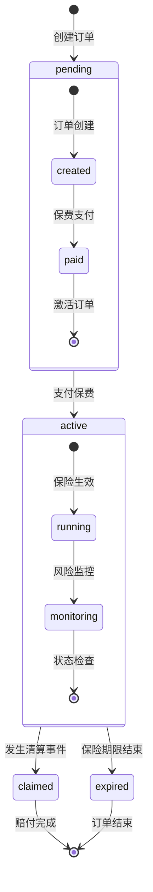
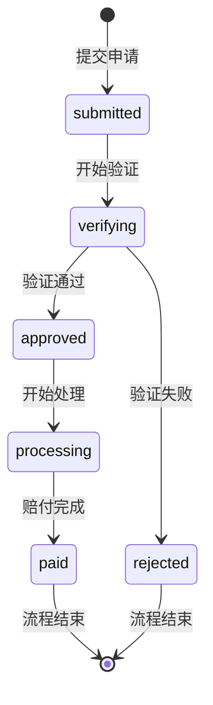

# 术语表 & 状态机

## 核心术语

### 保险相关
- **保险订单 (Insurance Order)**：用户购买的保险合约，包含金额、杠杆、期限等参数
- **保费 (Premium)**：用户支付的保险费用，基于保险金额和风险计算
- **杠杆倍数 (Leverage)**：保险金额与保费的比例，决定赔付倍数
- **保险期限 (Duration)**：保险的有效时间，以天为单位
- **清算事件 (Liquidation Event)**：用户在交易所被强制平仓的事件
- **赔付 (Claim)**：发生清算事件后，系统向用户支付的保险金

### 技术术语
- **智能合约 (Smart Contract)**：在区块链上执行的自动化合约代码
- **事件监听 (Event Listening)**：监控区块链上合约事件的变化
- **API密钥 (API Key)**：用于访问交易所API的认证凭证
- **状态机 (State Machine)**：定义订单状态流转的逻辑
- **Gas费用 (Gas Fee)**：在以太坊上执行交易的手续费

### 业务术语
- **风险控制 (Risk Control)**：系统对保险业务的风险管理机制
- **证据收集 (Evidence Collection)**：收集和验证清算事件的证明材料
- **反欺诈 (Fraud Prevention)**：防止虚假赔付申请的措施
- **等待期 (Waiting Period)**：保险生效前的等待时间

## 状态机定义

### 保险订单状态机



#### 状态说明

**pending（待激活）**
- **created**：订单已创建，等待用户支付保费
- **paid**：保费已支付，等待订单激活
- **转入active条件**：保费支付确认且等待期结束

**active（生效中）**
- **running**：保险正常生效，处于保护期内
- **monitoring**：系统持续监控风险状态
- **转出条件**：
  - 发生清算事件 → claimed
  - 保险期限结束 → expired

**claimed（已赔付）**
- 清算事件已验证，赔付流程已启动
- 赔付金额已计算并准备支付
- 最终状态，订单生命周期结束

**expired（已过期）**
- 保险期限已到，未发生清算事件
- 订单自然结束，无赔付发生
- 最终状态，订单生命周期结束

### 赔付申请状态机



#### 状态说明

**submitted（已提交）**
- 用户提交赔付申请
- 系统接收申请并分配验证任务

**verifying（验证中）**
- jp-verify服务验证清算事件真实性
- 收集交易所证据和链上数据
- 风险评估和欺诈检测

**approved（已批准）**
- 清算事件验证通过
- 赔付金额计算完成
- 准备执行智能合约赔付

**rejected（已拒绝）**
- 清算事件验证失败
- 可能存在欺诈或证据不足
- 申请被拒绝，无赔付

**processing（处理中）**
- 调用智能合约执行赔付
- 等待区块链交易确认
- 监控交易状态

**paid（已支付）**
- 赔付金额已成功转账到用户钱包
- 赔付流程完成
- 最终状态

## 枚举类型

### 订单状态枚举
```typescript
export enum OrderStatus {
  PENDING = 'pending',      // 待激活
  ACTIVE = 'active',        // 生效中
  CLAIMED = 'claimed',      // 已赔付
  EXPIRED = 'expired'       // 已过期
}
```

### 赔付状态枚举
```typescript
export enum ClaimStatus {
  SUBMITTED = 'submitted',  // 已提交
  VERIFYING = 'verifying',   // 验证中
  APPROVED = 'approved',     // 已批准
  REJECTED = 'rejected',     // 已拒绝
  PROCESSING = 'processing', // 处理中
  PAID = 'paid'             // 已支付
}
```

### 事件类型枚举
```typescript
export enum EventType {
  ORDER_CREATED = 'OrderCreated',      // 订单创建
  PREMIUM_PAID = 'PremiumPaid',        // 保费支付
  ORDER_ACTIVATED = 'OrderActivated',  // 订单激活
  LIQUIDATION_DETECTED = 'LiquidationDetected', // 清算检测
  CLAIM_SUBMITTED = 'ClaimSubmitted',   // 赔付提交
  CLAIM_PROCESSED = 'ClaimProcessed'  // 赔付处理
}
```

## 数据格式规范

### 金额格式
- 所有金额以**最小单位**存储（USDC为6位小数）
- 前端显示时转换为标准格式
- 计算时使用BigNumber避免精度问题

### 时间格式
- 使用ISO 8601格式：`YYYY-MM-DDTHH:mm:ss.sssZ`
- 区块链时间使用Unix时间戳（秒）
- 前端显示使用本地时区

### 地址格式
- 以太坊地址使用小写格式
- 合约地址需要验证有效性
- 交易哈希使用0x前缀

## 相关链接

- [系统架构](../00-overview/architecture.md)
- [API参考](../03-reference/api/)
- [智能合约参考](../03-reference/contracts/checkoutusdc.md)