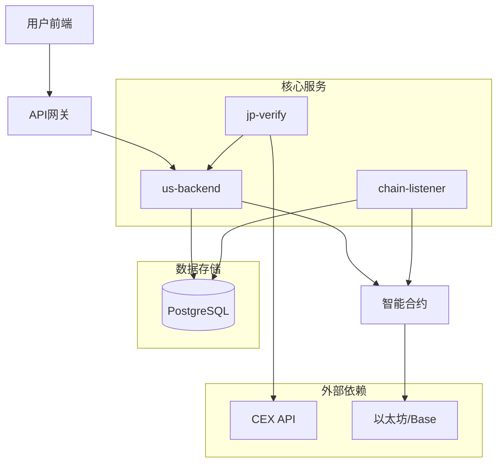
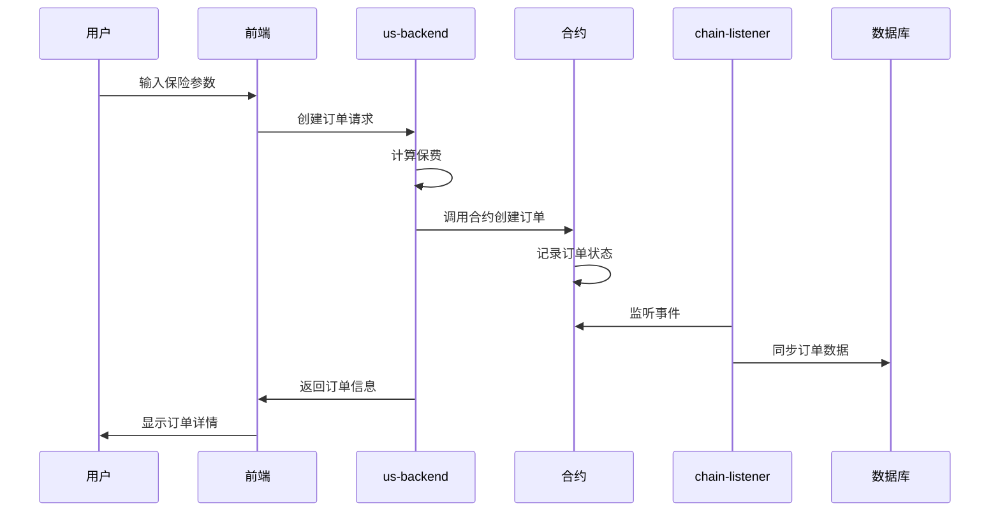
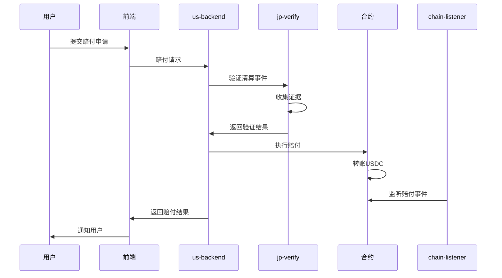

# 系统架构

## 总体架构图

## 核心组件

### 1. us-backend（业务逻辑层）
- **职责**：处理保险订单、保费计算、赔付逻辑
- **技术栈**：Node.js + TypeScript + Express
- **关键功能**：
  - 订单管理（创建、查询、状态更新）
  - 保费计算（基于杠杆和期限）
  - 赔付验证和触发

### 2. chain-listener（链上事件监听）
- **职责**：监听智能合约事件，同步链上数据
- **技术栈**：Node.js + ethers.js
- **关键功能**：
  - 实时监听合约事件
  - 数据入库和状态同步
  - 事件重放和容错处理

### 3. jp-verify（交易所验证服务）
- **职责**：验证交易所清算事件真实性
- **技术栈**：Python + FastAPI
- **关键功能**：
  - 交易所API集成
  - 清算事件验证
  - 证据收集和存储

### 4. 智能合约（CheckoutUSDC）
- **职责**：处理核心保险逻辑和资金管理
- **技术栈**：Solidity + Hardhat
- **关键功能**：
  - USDC代币管理
  - 保险订单状态机
  - 赔付执行逻辑

## 数据流设计

### 正向流程（购买保险）

### 逆向流程（申请赔付）

## 核心数据表

### orders表（保险订单）
- `order_id`：订单唯一标识
- `user_address`：用户钱包地址
- `amount`：保险金额（USDC）
- `leverage`：杠杆倍数
- `duration`：保险期限（天）
- `premium`：保费金额
- `status`：订单状态（pending/active/claimed/expired）
- `created_at`：创建时间
- `updated_at`：更新时间

### claims表（赔付记录）
- `claim_id`：赔付记录ID
- `order_id`：关联订单ID
- `claim_amount`：赔付金额
- `evidence`：证据数据
- `status`：赔付状态
- `created_at`：申请时间
- `processed_at`：处理时间

### contract_events表（合约事件）
- `event_id`：事件ID
- `tx_hash`：交易哈希
- `event_type`：事件类型
- `block_number`：区块号
- `log_index`：日志索引
- `event_data`：事件数据
- `processed`：是否已处理

## 信任边界

### 内部可信组件
- us-backend业务逻辑
- chain-listener事件监听
- jp-verify验证服务
- 智能合约代码

### 外部依赖
- 区块链网络（以太坊/Base）
- 交易所API（Binance、OKX等）
- USDC代币合约
- 用户钱包

### 安全边界
- API密钥仅用于查询，不存储私钥
- 所有资金操作通过智能合约执行
- 多层签名验证机制
- 实时风险监控和告警

## 扩展性设计

### 水平扩展
- 无状态服务可水平扩展
- 数据库读写分离
- 缓存层减少数据库压力

### 多链支持
- 模块化设计支持多链部署
- 统一的接口抽象
- 链特定的配置管理

### 插件架构
- 可插拔的验证服务
- 可配置的风险参数
- 灵活的赔付策略