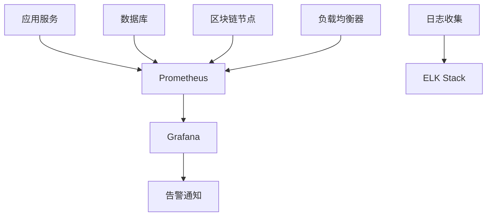

# 监控配置指南

## 概述
本文档详细说明LiqPass系统的监控配置，包括指标收集、告警设置、日志管理和可视化展示。

## 监控架构

### 组件概览


### 监控层次
1. **基础设施层**: 服务器资源、网络状态
2. **应用层**: 服务健康、性能指标
3. **业务层**: 交易量、用户行为
4. **区块链层**: 合约事件、Gas消耗

## 指标收集

### Prometheus配置

#### 抓取配置 (scrape_configs)
```yaml
scrape_configs:
  - job_name: 'liqpass-backend'
    static_configs:
      - targets: ['backend:8080']
    metrics_path: '/metrics'
    scrape_interval: 15s

  - job_name: 'postgresql'
    static_configs:
      - targets: ['postgres-exporter:9187']
    scrape_interval: 30s

  - job_name: 'redis'
    static_configs:
      - targets: ['redis-exporter:9121']
    scrape_interval: 30s

  - job_name: 'node-exporter'
    static_configs:
      - targets: ['node-exporter:9100']
    scrape_interval: 30s
```

#### 关键业务指标

**订单相关指标**
```promql
# 订单创建速率
rate(orders_created_total[5m])

# 订单状态分布
sum by (status) (orders_total)

# 订单处理延迟
histogram_quantile(0.95, rate(order_processing_duration_seconds_bucket[5m]))
```

**赔付相关指标**
```promql
# 赔付申请速率
rate(claims_submitted_total[5m])

# 赔付成功率
sum(claims_approved_total) / sum(claims_submitted_total)

# 赔付处理时间
histogram_quantile(0.95, rate(claim_processing_duration_seconds_bucket[5m]))
```

**区块链相关指标**
```promql
# 合约调用成功率
rate(contract_calls_success_total[5m]) / rate(contract_calls_total[5m])

# Gas消耗监控
avg(contract_gas_used)

# 区块确认延迟
avg(block_confirmation_delay_seconds)
```

## 告警规则

### 关键告警配置

#### 基础设施告警
```yaml
groups:
  - name: infrastructure
    rules:
      - alert: HighCPUUsage
        expr: 100 - (avg by (instance) (rate(node_cpu_seconds_total{mode="idle"}[5m])) * 100) > 80
        for: 5m
        labels:
          severity: warning
        annotations:
          summary: "高CPU使用率"
          description: "实例 {{ $labels.instance }} CPU使用率超过80%"

      - alert: HighMemoryUsage
        expr: (node_memory_MemTotal_bytes - node_memory_MemAvailable_bytes) / node_memory_MemTotal_bytes * 100 > 85
        for: 5m
        labels:
          severity: warning
        annotations:
          summary: "高内存使用率"
          description: "实例 {{ $labels.instance }} 内存使用率超过85%"
```

#### 应用服务告警
```yaml
  - name: application
    rules:
      - alert: ServiceDown
        expr: up{job=~"liqpass.*"} == 0
        for: 1m
        labels:
          severity: critical
        annotations:
          summary: "服务不可用"
          description: "服务 {{ $labels.job }} 已下线"

      - alert: HighErrorRate
        expr: rate(http_requests_total{status=~"5.."}[5m]) / rate(http_requests_total[5m]) > 0.05
        for: 2m
        labels:
          severity: warning
        annotations:
          summary: "高错误率"
          description: "服务错误率超过5%"
```

#### 业务指标告警
```yaml
  - name: business
    rules:
      - alert: OrderProcessingSlow
        expr: histogram_quantile(0.95, rate(order_processing_duration_seconds_bucket[5m])) > 30
        for: 5m
        labels:
          severity: warning
        annotations:
          summary: "订单处理缓慢"
          description: "95%订单处理时间超过30秒"

      - alert: LowClaimApprovalRate
        expr: sum(claims_approved_total[1h]) / sum(claims_submitted_total[1h]) < 0.8
        for: 1h
        labels:
          severity: warning
        annotations:
          summary: "赔付批准率低"
          description: "赔付批准率低于80%"
```

## 日志管理

### ELK Stack配置

#### Logstash管道配置
```ruby
input {
  beats {
    port => 5044
  }
}

filter {
  if [service] == "liqpass-backend" {
    grok {
      match => { "message" => "%{TIMESTAMP_ISO8601:timestamp} %{LOGLEVEL:level} %{GREEDYDATA:message}" }
    }
    date {
      match => [ "timestamp", "ISO8601" ]
    }
  }
}

output {
  elasticsearch {
    hosts => ["elasticsearch:9200"]
    index => "liqpass-%{+YYYY.MM.dd}"
  }
}
```

#### 日志字段规范
```json
{
  "timestamp": "2024-01-15T10:30:00.000Z",
  "level": "INFO",
  "service": "liqpass-backend",
  "trace_id": "abc123-def456",
  "user_id": "user-789",
  "order_id": "order-123",
  "message": "订单创建成功",
  "duration_ms": 150,
  "status": "success"
}
```

## 可视化仪表板

### Grafana配置

#### 核心仪表板
1. **系统概览仪表板**
   - 服务健康状态
   - 资源使用情况
   - 请求流量统计

2. **业务监控仪表板**
   - 订单处理指标
   - 赔付流程监控
   - 用户行为分析

3. **区块链监控仪表板**
   - 合约调用统计
   - Gas消耗分析
   - 交易确认时间

#### 仪表板示例配置
```json
{
  "title": "LiqPass业务监控",
  "panels": [
    {
      "title": "订单处理统计",
      "type": "stat",
      "targets": [
        {
          "expr": "rate(orders_created_total[5m])",
          "legendFormat": "订单创建速率"
        }
      ]
    }
  ]
}
```

## 告警通知

### 通知渠道配置

#### Slack通知
```yaml
route:
  group_by: ['alertname']
  group_wait: 10s
  group_interval: 10s
  repeat_interval: 1h
  receiver: 'slack-notifications'

receivers:
- name: 'slack-notifications'
  slack_configs:
  - api_url: 'https://hooks.slack.com/services/...'
    channel: '#alerts'
    title: '{{ .GroupLabels.alertname }}'
    text: '{{ range .Alerts }}{{ .Annotations.description }}\n{{ end }}'
```

#### 邮件通知
```yaml
- name: 'email-notifications'
  email_configs:
  - to: 'devops@liqpass.com'
    from: 'alertmanager@liqpass.com'
    smarthost: 'smtp.liqpass.com:587'
    auth_username: 'alertmanager'
    auth_password: 'password'
    headers:
      subject: 'LiqPass告警通知'
```

## 性能优化

### 监控数据保留策略
```yaml
# Prometheus配置
retention: 15d
retention_size: 50GB

# 采样策略
- record: job:http_requests:rate5m
  expr: rate(http_requests_total[5m])
```

### 资源优化建议
1. **数据压缩**: 启用snappy压缩
2. **查询优化**: 使用Recording Rules
3. **存储优化**: 分层存储策略
4. **网络优化**: 批量数据传输

## 故障排除

### 常见问题

#### 监控数据缺失
**症状**: 某些指标在Grafana中显示为空白
**排查步骤**:
1. 检查Prometheus目标状态
2. 验证服务端指标端点
3. 检查网络连通性
4. 查看服务日志

#### 告警误报
**症状**: 频繁收到不准确的告警
**解决方案**:
1. 调整告警阈值
2. 增加告警持续时间
3. 添加更精确的过滤条件
4. 使用更复杂的告警表达式

#### 性能问题
**症状**: 监控系统本身资源消耗过高
**优化建议**:
1. 减少采样频率
2. 优化查询语句
3. 增加硬件资源
4. 使用集群部署

## 最佳实践

### 监控设计原则
1. **可观测性**: 确保关键业务路径可监控
2. **可操作性**: 告警信息应包含修复指导
3. **可扩展性**: 支持业务增长和架构变化
4. **安全性**: 保护监控数据的隐私和安全

### 运维建议
1. **定期演练**: 模拟故障测试监控系统
2. **文档更新**: 保持监控配置文档最新
3. **容量规划**: 预估监控数据增长趋势
4. **备份策略**: 定期备份监控配置和数据

## 相关文档
- [部署指南](../deployment-guide.md)
- [安全模型](../00-overview/security-model.md)
- [测试策略](../06-testing/test-strategy.md)

## 更新日志
- **v1.0** (2024-01-15): 初始版本，包含基础监控配置
- **v1.1** (计划): 添加高级监控功能和优化建议

---

**最后更新**: 2024年1月  
**维护团队**: LiqPass运维团队