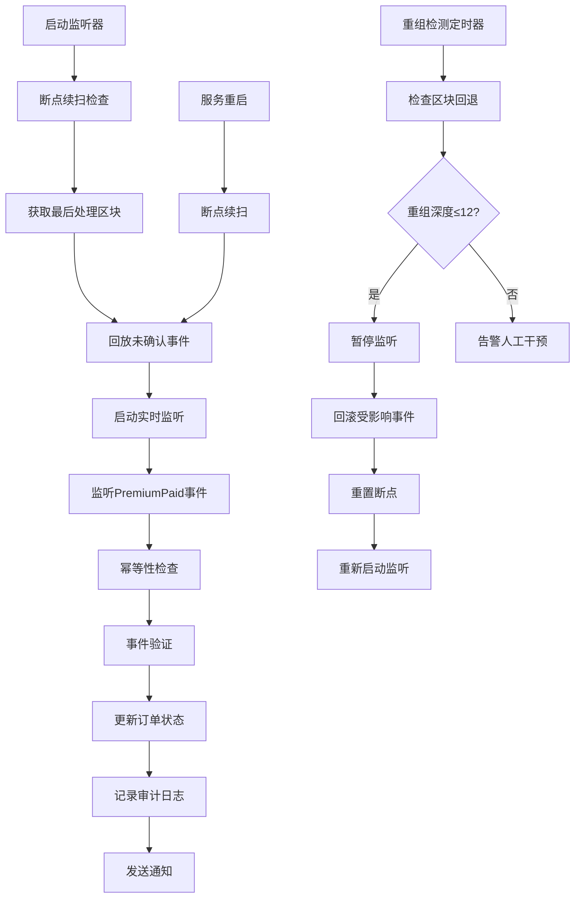

# LiqPass 链路可靠性审查报告

## 执行摘要

本报告对 LiqPass 项目的链上事件监听与处理链路进行可靠性审查，重点关注 PremiumPaid 事件的幂等入库、断点续扫、状态驱动和审计追踪机制。审查范围涵盖链监听服务、数据库约束、事件回放和重组处理逻辑。

**审查时间**：2024年12月  
**审查范围**：`/apps/us-backend/src/services/contractListenerService.ts` 及相关数据库迁移文件

## 1. 监听与写库流程图

### 1.1 核心流程描述



### 1.2 脆弱点分析

| 脆弱点 | 风险等级 | 影响 | 当前防护措施 | 改进建议 |
|--------|----------|------|-------------|----------|
| **链重组处理** | 🔴 高 | 事件重复或丢失 | 12区块深度检测，自动回滚 | 增加深度阈值配置，支持手动干预接口 |
| **数据库连接中断** | 🟡 中 | 事件处理失败 | 错误重试机制 | 实现连接池健康检查，自动重连 |
| **RPC节点不稳定** | 🟡 中 | 监听中断 | 多RPC节点切换 | 实现RPC节点健康检查和故障转移 |
| **事件验证失败** | 🟡 中 | 订单状态不一致 | 字段完整性检查 | 增加事件签名验证，防止恶意事件 |
| **内存泄漏** | 🟠 低 | 服务崩溃 | 事件监听器清理 | 增加内存监控和自动重启机制 |

## 2. 幂等/回放验证步骤

### 2.1 幂等性验证脚本

```bash
#!/bin/bash
# 幂等性验证脚本 - PremiumPaid事件

# 环境变量设置
export DB_PATH="/path/to/database.db"
export CONTRACT_ADDRESS="0x..."
export RPC_URL="https://..."

# 1. 生成测试事件
echo "🔧 生成测试事件..."
TEST_TX_HASH="0x$(openssl rand -hex 32)"
TEST_LOG_INDEX=$((RANDOM % 100))

# 2. 第一次处理事件
echo "📝 第一次处理事件..."
node -e "
const { ContractListenerService } = require('./contractListenerService');
const service = new ContractListenerService();
await service.handleEvent('$TEST_TX_HASH', $TEST_LOG_INDEX);
"

# 3. 检查数据库记录
echo "🔍 检查数据库记录..."
sqlite3 "$DB_PATH" "SELECT COUNT(*) FROM contract_events WHERE tx_hash='$TEST_TX_HASH' AND log_index=$TEST_LOG_INDEX;"

# 4. 第二次处理相同事件
echo "📝 第二次处理相同事件..."
node -e "
const { ContractListenerService } = require('./contractListenerService');
const service = new ContractListenerService();
await service.handleEvent('$TEST_TX_HASH', $TEST_LOG_INDEX);
"

# 5. 验证幂等性
echo "✅ 验证幂等性..."
COUNT=$(sqlite3 "$DB_PATH" "SELECT COUNT(*) FROM contract_events WHERE tx_hash='$TEST_TX_HASH' AND log_index=$TEST_LOG_INDEX;")
if [ "$COUNT" -eq "1" ]; then
    echo "🎉 幂等性验证通过：事件仅处理一次"
else
    echo "❌ 幂等性验证失败：事件处理了 $COUNT 次"
fi
```

### 2.2 回放验证步骤

```bash
#!/bin/bash
# 回放验证脚本 - 断点续扫

# 1. 记录当前状态
echo "📊 记录当前监听状态..."
CURRENT_BLOCK=$(curl -s -X POST -H "Content-Type: application/json" --data '{"jsonrpc":"2.0","method":"eth_blockNumber","params":[],"id":1}' "$RPC_URL" | jq -r '.result' | xargs printf "%d")
LAST_PROCESSED=$(sqlite3 "$DB_PATH" "SELECT block_number FROM event_cursors WHERE cursor_key='premium_paid' ORDER BY id DESC LIMIT 1;" || echo "0")

echo "当前区块: $CURRENT_BLOCK"
echo "最后处理区块: $LAST_PROCESSED"

# 2. 停止监听器
echo "🛑 停止监听器..."
node -e "
const { ContractListenerService } = require('./contractListenerService');
const service = new ContractListenerService();
await service.stopListening();
"

# 3. 模拟服务重启
echo "🔄 模拟服务重启..."
sleep 5

# 4. 重新启动监听器
echo "🚀 重新启动监听器..."
node -e "
const { ContractListenerService } = require('./contractListenerService');
const service = new ContractListenerService();
await service.startListening();
"

# 5. 验证断点续扫
echo "🔍 验证断点续扫..."
NEW_LAST_PROCESSED=$(sqlite3 "$DB_PATH" "SELECT block_number FROM event_cursors WHERE cursor_key='premium_paid' ORDER BY id DESC LIMIT 1;")

if [ "$NEW_LAST_PROCESSED" -gt "$LAST_PROCESSED" ]; then
    echo "✅ 断点续扫验证通过：从区块 $LAST_PROCESSED 继续处理"
else
    echo "⚠️  断点续扫验证：无新事件处理"
fi
```

## 3. 需要追加的唯一键/索引

### 3.1 数据库约束补充

```sql
-- 追加复合唯一索引（增强幂等性）
CREATE UNIQUE INDEX IF NOT EXISTS idx_contract_events_tx_log_chain 
ON contract_events(tx_hash, log_index, chain_id);

-- 追加状态+时间索引（优化查询性能）
CREATE INDEX IF NOT EXISTS idx_contract_events_status_created 
ON contract_events(status, created_at);

-- 追加区块范围索引（优化回放查询）
CREATE INDEX IF NOT EXISTS idx_contract_events_block_range 
ON contract_events(block_number, log_index);

-- 追加订单状态索引（优化状态查询）
CREATE INDEX IF NOT EXISTS idx_orders_status_updated 
ON orders(status, updated_at);

-- 追加事件游标索引（优化断点查询）
CREATE INDEX IF NOT EXISTS idx_event_cursors_key_processed 
ON event_cursors(cursor_key, processed_at);
```

### 3.2 最小代码接触点

#### 3.2.1 文件：`contractListenerService.ts`

**函数：`isEventProcessed` (第347-360行)**
```typescript
// 当前实现：仅检查tx_hash + log_index
private async isEventProcessed(txHash: string, logIndex: number): Promise<boolean> {
    return new Promise((resolve, reject) => {
        this.db.get(
            'SELECT id FROM contract_events WHERE tx_hash = ? AND log_index = ?',
            [txHash, logIndex],
            (err: Error | null, row: any) => {
                if (err) {
                    console.error('❌ 查询事件处理状态失败:', err);
                    reject(err);
                    return;
                }
                resolve(!!row);
            }
        );
    });
}

// 建议增强：增加chain_id检查
private async isEventProcessed(txHash: string, logIndex: number, chainId: string): Promise<boolean> {
    return new Promise((resolve, reject) => {
        this.db.get(
            'SELECT id FROM contract_events WHERE tx_hash = ? AND log_index = ? AND chain_id = ?',
            [txHash, logIndex, chainId],
            (err: Error | null, row: any) => {
                if (err) {
                    console.error('❌ 查询事件处理状态失败:', err);
                    reject(err);
                    return;
                }
                resolve(!!row);
            }
        );
    });
}
```

**函数：`recordEvent` (第363-395行)**
```typescript
// 当前实现：缺少chain_id字段
private async recordEvent(eventData: {
    txHash: string;
    logIndex: number;
    orderId: string;
    buyer: string;
    amount: string;
    quoteHash: string;
    blockNumber: number;
    timestamp: Date;
    token?: string | null;
    treasury?: string | null;
}): Promise<void> {
    // 建议增强：添加chain_id字段存储
    return new Promise((resolve, reject) => {
        this.db.run(
            `INSERT INTO contract_events (
                tx_hash, log_index, order_id, buyer_address, amount, 
                quote_hash, block_number, event_timestamp, status, chain_id
            ) VALUES (?, ?, ?, ?, ?, ?, ?, ?, ?, ?)`,
            [
                eventData.txHash,
                eventData.logIndex,
                eventData.orderId,
                eventData.buyer,
                eventData.amount,
                eventData.quoteHash,
                eventData.blockNumber,
                Math.floor(eventData.timestamp.getTime() / 1000),
                'processed',
                this.chainId // 新增chain_id
            ],
            function(this: any, err: Error | null) {
                if (err) {
                    console.error('❌ 记录事件到数据库失败:', err);
                    reject(err);
                    return;
                }
                console.log('✅ 事件记录成功，ID:', this.lastID);
                resolve();
            }
        );
    });
}
```

#### 3.2.2 文件：`001_create_contract_events.sql`

**表结构增强：**
```sql
-- 修改表结构，添加chain_id字段
ALTER TABLE contract_events ADD COLUMN chain_id TEXT NOT NULL DEFAULT '1';

-- 删除旧的唯一约束
DROP INDEX IF EXISTS idx_contract_events_tx_hash_log_index;

-- 创建新的复合唯一约束（支持多链）
CREATE UNIQUE INDEX IF NOT EXISTS idx_contract_events_tx_log_chain 
ON contract_events(tx_hash, log_index, chain_id);

-- 添加chain_id索引
CREATE INDEX IF NOT EXISTS idx_contract_events_chain_id 
ON contract_events(chain_id);
```

## 4. 审计日志增强

### 4.1 监听日志格式标准

```typescript
// 标准审计日志格式
interface AuditLog {
    timestamp: string;           // ISO时间戳
    eventType: 'premium_paid' | 'reorganization' | 'replay';
    transactionHash?: string;    // 交易哈希
    logIndex?: number;          // 日志索引
    blockNumber: number;         // 区块高度
    chainId: string;            // 链ID
    retryCount: number;         // 重试次数
    operation: 'insert' | 'update' | 'delete';
    table: string;              // 操作表名
    recordId?: number;          // 记录ID
    success: boolean;           // 操作结果
    errorMessage?: string;      // 错误信息
    durationMs: number;         // 操作耗时
}

// 示例日志输出
{
    "timestamp": "2024-12-19T10:30:00.000Z",
    "eventType": "premium_paid",
    "transactionHash": "0x123...",
    "logIndex": 5,
    "blockNumber": 12345678,
    "chainId": "8453",
    "retryCount": 0,
    "operation": "insert",
    "table": "contract_events",
    "recordId": 42,
    "success": true,
    "durationMs": 15
}
```

### 4.2 关键审计点

1. **事件接收**：记录监听到的原始事件数据
2. **幂等检查**：记录检查过程和结果
3. **事件验证**：记录字段验证结果
4. **数据库操作**：记录写库操作和结果
5. **状态更新**：记录订单状态变更
6. **重组处理**：记录重组检测和处理过程
7. **回放操作**：记录断点续扫过程

## 5. 验收标准

### 5.1 幂等性验收
- ✅ 相同tx_hash + log_index的事件仅处理一次
- ✅ 数据库唯一约束阻止重复插入
- ✅ 重启服务后不会重复处理已确认事件

### 5.2 断点续扫验收
- ✅ 服务重启后从最后确认高度继续扫描
- ✅ 重组事件正确处理和回滚
- ✅ 回放窗口内事件不会丢失

### 5.3 事件完整性验收
- ✅ 所有必需字段齐全且类型正确
- ✅ 链上数据与数据库存储一致
- ✅ 订单状态仅由链上事件驱动

### 5.4 审计追踪验收
- ✅ 监听日志包含完整操作信息
- ✅ 错误场景有详细错误日志
- ✅ 性能指标可监控和告警

## 6. 改进建议

### 6.1 短期改进（P0）
1. **添加chain_id字段**：支持多链部署
2. **增强唯一约束**：tx_hash + log_index + chain_id复合唯一键
3. **完善审计日志**：标准化日志格式和关键审计点

### 6.2 中期改进（P1）
1. **实现RPC故障转移**：多节点健康检查和自动切换
2. **增加监控告警**：监听器状态、处理延迟、错误率监控
3. **优化重组处理**：支持配置化重组深度和手动干预

### 6.3 长期改进（P2）
1. **实现事件溯源**：完整的事件处理链路追踪
2. **支持水平扩展**：多实例监听器协调机制
3. **增强安全性**：事件签名验证和防重放攻击

---

**文档版本**: v1.0  
**最后更新**: 2024-12-19  
**维护者**: LiqPass开发团队