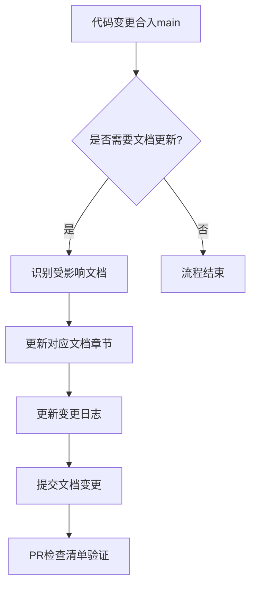

# 文档更新节奏规范

## 1. 概述

本文档定义了 LiqPass 项目的文档更新机制，确保代码变更与文档同步，避免"预言式文档"问题。

## 2. 适用范围

- `docs/` 目录下的所有文档
- `apps/*/README.md` 各应用模块的README文件
- 主 `README.md` 文件

## 3. 更新机制

### 3.1 核心原则

**当日同步原则**：任何关键修复合入 main 分支的当日，必须同步更新对应文档章节。

**禁止预言式文档**：文档只记录"已生效事实"，不记录计划或未实现的功能。

### 3.2 触发条件

以下情况必须触发文档更新：

1. **功能变更**：新增、修改或删除功能
2. **接口变更**：API接口、数据库Schema变更
3. **配置变更**：环境变量、配置文件变更
4. **部署变更**：部署流程、运维脚本变更
5. **安全变更**：安全策略、权限变更

### 3.3 更新流程



## 4. PR检查清单

每个Pull Request必须包含以下检查项：

### 4.1 文档更新检查

- [ ] **docs updated?** - 相关文档是否已更新
- [ ] **change log updated?** - 变更日志是否已更新
- [ ] **README updated?** - README文件是否已更新
- [ ] **API docs updated?** - API文档是否已更新

### 4.2 质量检查

- [ ] **文档准确性** - 文档内容与代码实现一致
- [ ] **格式规范** - 符合Markdown格式规范
- [ ] **链接有效** - 所有内部链接有效
- [ ] **示例正确** - 代码示例可运行

## 5. 变更日志模板

### 5.1 主README变更日志格式

```markdown
## 修复清单（Changelog）

### [YYYY-MM-DD]
- **功能**: 简要描述功能变更
- **修复**: 简要描述问题修复
- **优化**: 简要描述性能优化
- **文档**: 简要描述文档更新

**验证**: 端到端测试结果（如：订单 #YYYYMMDD-0001）

### 历史记录
- 2025-11-10: 补齐 .env.sample；统一 premiumUSDC；引入 SQLite 适配与 001_init；监听器 12 确认策略；PremiumPaid 事件扩展。
- 验证：端到端下单演练成功（订单 #20251110-0001）。
```

### 5.2 模块级变更日志

各应用模块应在README中维护独立的变更记录：

```markdown
## 变更记录

### [版本号] - YYYY-MM-DD
- 变更内容1
- 变更内容2
- 相关PR链接
```

## 6. 文档分类与负责人

| 文档类型 | 负责人 | 更新频率 | 检查点 |
|---------|--------|---------|--------|
| 产品文档 | 产品经理 | 功能发布时 | 功能验收后 |
| 技术文档 | 技术负责人 | 代码合入时 | PR合并前 |
| API文档 | 后端开发 | 接口变更时 | 接口测试后 |
| 部署文档 | 运维工程师 | 部署流程变更时 | 部署验证后 |
| 安全文档 | 安全工程师 | 安全策略变更时 | 安全审计后 |

## 7. 自动化工具

### 7.1 文档链接检查

```bash
# 检查文档内部链接有效性
npm run docs:check-links
```

### 7.2 文档格式检查

```bash
# 检查Markdown格式规范
npm run docs:lint
```

### 7.3 变更日志生成

```bash
# 基于git提交生成变更日志草稿
npm run changelog:generate
```

## 8. 质量保证

### 8.1 文档评审

- **技术评审**：技术负责人审核技术准确性
- **产品评审**：产品经理审核业务逻辑准确性
- **用户体验评审**：确保文档易于理解

### 8.2 版本控制

- 文档与代码使用相同的分支策略
- 重大变更需要创建文档分支
- 文档回滚与代码回滚同步

### 8.3 备份策略

- 定期备份重要文档
- 文档变更记录在git历史中
- 重要文档版本打tag标记

## 9. 异常处理

### 9.1 文档滞后处理

如果文档更新滞后于代码变更：

1. 创建紧急文档更新任务
2. 标记为高优先级
3. 24小时内完成更新
4. 记录滞后原因和改进措施

### 9.2 文档冲突处理

如果多人同时修改同一文档：

1. 使用git冲突解决机制
2. 协调相关人员共同评审
3. 确保最终版本的一致性

## 10. 持续改进

### 10.1 定期回顾

每月回顾文档更新机制的有效性：

- 文档更新及时性统计
- 文档质量问题分析
- 用户反馈收集
- 机制优化建议

### 10.2 指标监控

- **文档更新延迟率**：目标 < 5%
- **文档准确率**：目标 > 95%
- **用户满意度**：定期调查

---

**最后更新**: 2025-01-20  
**负责人**: 项目管理组  
**审核人**: 技术负责人、产品负责人