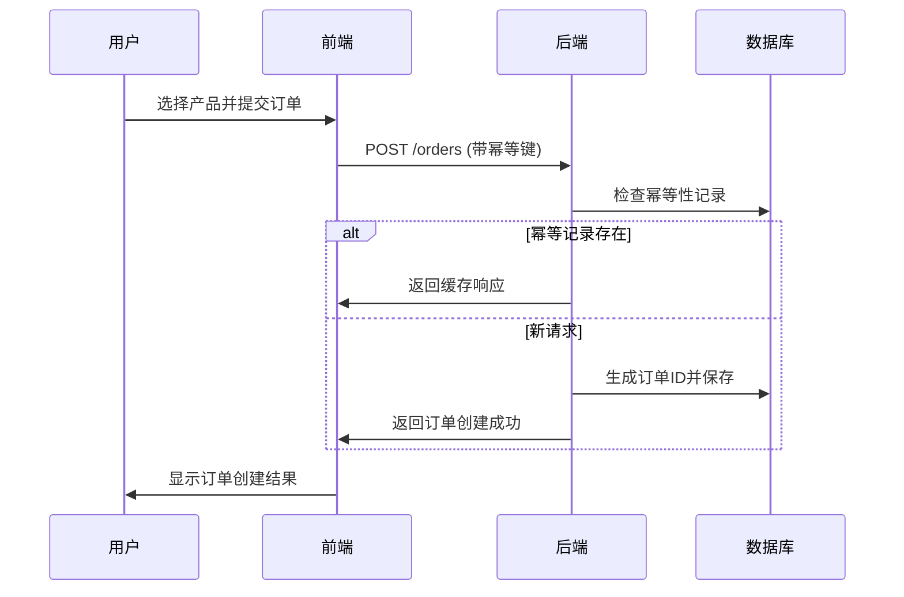
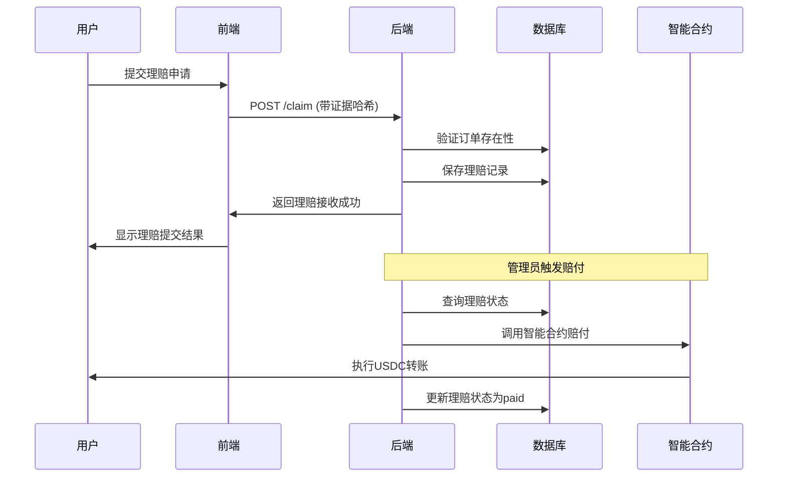

# 美国服务器交互逻辑文档

## 📋 文档概述

本文档详细描述了美国服务器内部前端与后端之间的交互逻辑，包括订单创建、验证、理赔等核心业务流程的实现细节。

## 🏗️ 整体架构

### 架构模式
**前后端分离架构**：
```
美国前端 (React + TypeScript) → 美国后端 (Node.js + Express)
```

### 服务器配置

| 组件 | 端口 | 技术栈 | 主要功能 |
|------|------|--------|----------|
| **美国前端** | 5173 | React, TypeScript, TailwindCSS | 用户界面、订单创建、验证提交 |
| **美国后端** | 8080 | Node.js, Express, SQLite | API服务、订单管理、理赔处理 |

## 🔌 API接口规范

### 1. 健康检查接口

**接口路径：** `GET /healthz`

**响应格式：**
```json
{
  "status": "ok",
  "payoutMode": "simulate",
  "defaultPayoutAddress": "0x00195EcF4FF21aB985b13FC741Cdf276C71D88A1",
  "timestamp": "2024-01-01T00:00:00.000Z"
}
```

### 2. 产品目录接口

**接口路径：** `GET /catalog/skus`

**响应格式：**
```json
[
  {
    "id": "DAY_24H_FIXED",
    "title": "DAY_24H_FIXED",
    "premium": 5000,
    "payout": 100000,
    "exchange": "binance"
  },
  {
    "id": "DAY_24H_OKX",
    "title": "DAY_24H_OKX",
    "premium": 4000,
    "payout": 80000,
    "exchange": "okx"
  }
]
```

### 3. 订单创建接口

**接口路径：** `POST /orders`

**请求头：**
```
Idempotency-Key: <唯一幂等键>
Content-Type: application/json
```

**请求参数：**
```typescript
interface CreateOrderRequest {
  skuId: string;           // 产品SKU ID
  exchange: string;        // 交易所
  pair: string;           // 交易对
  orderRef: string;       // 订单引用
  wallet: string;         // 钱包地址
  premium: number;        // 保费（分）
  payout: number;         // 赔付金额（分）
  paymentMethod: string;  // 支付方式
}
```

**响应格式：**
```json
{
  "orderId": "uuid",
  "status": "created",
  "createdAt": "2024-01-01T00:00:00.000Z"
}
```

### 4. 订单历史查询接口

**接口路径：** `GET /orders/history?wallet=<钱包地址>`

**响应格式：**
```json
[
  {
    "id": "uuid",
    "wallet": "0x...",
    "skuId": "DAY_24H_FIXED",
    "exchange": "binance",
    "pair": "BTCUSDT",
    "orderRef": "订单号",
    "premium": 5000,
    "payout": 100000,
    "status": "created",
    "createdAt": "2024-01-01T00:00:00.000Z"
  }
]
```

### 5. 理赔提交接口

**接口路径：** `POST /claim`

**请求头：**
```
Idempotency-Key: <唯一幂等键>
Content-Type: application/json
```

**请求参数：**
```typescript
interface SubmitClaimRequest {
  orderId: string;        // 订单ID
  wallet: string;         // 钱包地址
  evidenceHash: string;   // 证据哈希
  reason?: string;        // 理赔原因（默认：liquidation）
}
```

**响应格式：**
```json
{
  "claimId": "uuid",
  "status": "received",
  "createdAt": "2024-01-01T00:00:00.000Z"
}
```

### 6. 管理员赔付接口

**接口路径：** `POST /admin/payout`

**请求参数：**
```typescript
interface AdminPayoutRequest {
  claimId: string;        // 理赔ID
}
```

**响应格式：**
```json
{
  "message": "Payout transaction sent successfully",
  "claimId": "uuid",
  "recipient": "0x...",
  "amount": "1000000000",
  "transactionHash": "0x..."
}
```

## 🔄 数据流处理

### 1. 订单创建流程



### 2. 理赔处理流程



## 🔒 安全机制

### 1. 幂等性保护
- 所有写操作必须包含 `Idempotency-Key` 请求头
- 后端基于幂等键缓存请求响应
- 防止重复提交和重复处理

### 2. CORS配置
```javascript
const corsOptions = {
  origin: ['http://localhost:5173'],
  methods: ['GET', 'POST', 'OPTIONS'],
  allowedHeaders: ['Content-Type', 'Authorization', 'Idempotency-Key'],
  credentials: true,
  optionsSuccessStatus: 204,
  maxAge: 600,
};
```

### 3. 请求验证
- 请求体大小限制：1MB
- JSON解析深度限制
- 必填字段验证
- 数据类型验证

### 4. 数据库安全
- 使用参数化查询防止SQL注入
- 敏感数据加密存储
- 事务处理保证数据一致性

## 💾 数据库设计

### 订单表 (orders)
```sql
CREATE TABLE orders (
  id TEXT PRIMARY KEY,
  wallet TEXT NOT NULL,
  skuId TEXT NOT NULL,
  exchange TEXT NOT NULL,
  pair TEXT NOT NULL,
  orderRef TEXT NOT NULL,
  premium INTEGER NOT NULL,
  payout INTEGER NOT NULL,
  status TEXT NOT NULL,
  createdAt TEXT NOT NULL
);
```

### 理赔表 (claims)
```sql
CREATE TABLE claims (
  id TEXT PRIMARY KEY,
  orderId TEXT NOT NULL,
  wallet TEXT NOT NULL,
  evidenceHash TEXT NOT NULL,
  reason TEXT NOT NULL,
  status TEXT NOT NULL,
  createdAt TEXT NOT NULL
);
```

### 幂等键表 (idempotency_keys)
```sql
CREATE TABLE idempotency_keys (
  key TEXT NOT NULL,
  route TEXT NOT NULL,
  reqHash TEXT NOT NULL,
  respJson TEXT NOT NULL,
  createdAt TEXT NOT NULL,
  PRIMARY KEY (key, route)
);
```

## 🛠️ 前端交互实现

### 1. API客户端配置

**文件：** `src/services/apiClient.ts`

```typescript
// 基础API配置
const DEFAULT_US_BASE = '/api/verify';
const DEFAULT_JP_BASE = 'http://127.0.0.1:8787';

// 环境变量加载
const US_API_BASE = import.meta.env.VITE_US_BACKEND_BASE || DEFAULT_US_BASE;
const JP_API_BASE = import.meta.env.VITE_JP_VERIFY_BASE || DEFAULT_JP_BASE;

// 核心请求函数
async function apiRequest<T>(path: string, options?: RequestInit): Promise<T> {
  const url = resolvePath(US_API_BASE, path);
  const response = await fetch(url, {
    headers: {
      'Content-Type': 'application/json',
      ...options?.headers,
    },
    ...options,
  });
  
  return readResponseBody<T>(response);
}
```

### 2. 验证服务实现

**文件：** `src/services/verify.ts`

```typescript
// 订单验证提交
export async function submitVerification(
  request: VerificationRequest,
  apiKeys?: ExchangeApiKeys
): Promise<VerificationResponse> {
  const auth = getAuthState();
  const payload = {
    exchange: mapExchangeId(request.exchange),
    pair: request.pairId,
    orderRef: request.orderId,
    wallet: request.wallet,
  };

  const headers: Record<string, string> = {
    'Content-Type': 'application/json',
  };
  
  if (auth.token) {
    headers.Authorization = `Bearer ${auth.token}`;
  }

  // API密钥处理
  if (apiKeys) {
    switch (request.exchange) {
      case 'Binance':
        if (apiKeys.binanceApiKey) {
          headers['X-MBX-APIKEY'] = apiKeys.binanceApiKey;
        }
        break;
      case 'OKX':
        if (apiKeys.okxApiKey) {
          headers['OK-ACCESS-KEY'] = apiKeys.okxApiKey;
          if (apiKeys.okxPassphrase) {
            headers['OK-ACCESS-PASSPHRASE'] = apiKeys.okxPassphrase;
          }
        }
        break;
    }
  }

  const raw = await jpApiRequestWithKeys<RawVerificationResponse>('/verify/order', {
    method: 'POST',
    headers,
    body: JSON.stringify(payload),
  });

  return normalizeVerificationResponse(raw, request);
}
```

### 3. 产品目录服务

**文件：** `src/services/catalog.ts`

```typescript
// 获取产品列表
export async function getSkus(): Promise<Sku[]> {
  const response = await apiRequest<unknown>('/catalog/skus');
  
  if (Array.isArray(response)) {
    return response.map(normaliseSku).filter(item => Boolean(item.id));
  }
  
  // 默认产品列表
  return [
    {
      id: 'DAY_24H_FIXED',
      title: 'DAY_24H_FIXED',
      premium: 5000,
      payout: 100000,
      exchange: 'binance',
    }
  ];
}
```

## 🚀 部署配置

### 环境变量配置

**前端 (.env)：**
```bash
VITE_US_BACKEND_BASE=/api/verify
VITE_JP_VERIFY_BASE=http://127.0.0.1:8787
```

**后端 (.env.us)：**
```bash
US_PORT=8080
PAYOUT_MODE=simulate
DEFAULT_PAYOUT_ADDRESS=0x00195EcF4FF21aB985b13FC741Cdf276C71D88A1
LOG_PATH=./logs/us-backend.log
ALLOW_ORIGIN=http://localhost:5173
PAYOUT_PRIVATE_KEY=<私钥>
BASE_RPC_URL=https://mainnet.base.org
CONTRACT_ADDRESS=0x9552b58d323993f84d01e3744f175f47a9462f94
```

### 启动脚本

**前端启动：**
```bash
cd packages/us-frontend
npm run dev
```

**后端启动：**
```bash
cd packages/us-backend
node src/server.js
```

## 📊 监控与日志

### 日志格式
```json
{
  "ts": "2024-01-01T00:00:00.000Z",
  "level": "info",
  "reqId": "uuid",
  "route": "/orders",
  "wallet": "0x...",
  "orderId": "uuid",
  "claimId": "uuid",
  "skuId": "DAY_24H_FIXED",
  "idempoKey": "幂等键",
  "httpStatus": 201,
  "latencyMs": 150,
  "msg": "order created"
}
```

### 错误处理
- 结构化错误响应
- 详细的错误信息
- 错误码分类
- 错误日志记录

## 🔍 关键发现与建议

### 当前实现状态
1. ✅ **订单创建流程** - 完整实现，包含幂等性保护
2. ✅ **理赔提交流程** - 基础实现，支持证据哈希
3. ✅ **管理员赔付** - 集成智能合约调用
4. ⚠️ **验证流程** - 依赖日本服务器，当前为存根实现
5. ⚠️ **身份验证** - 基础token支持，需要完善

### 建议优化
1. **完善验证逻辑** - 实现完整的订单验证流程
2. **增强安全性** - 添加JWT认证、请求签名
3. **性能优化** - 数据库索引、缓存策略
4. **监控告警** - 添加健康检查和告警机制

## 📝 总结

美国服务器的交互逻辑设计合理，采用了前后端分离架构，实现了核心的业务流程。通过幂等性保护、数据库事务、智能合约集成等技术手段，确保了系统的可靠性和安全性。建议后续重点完善验证逻辑和增强安全机制。