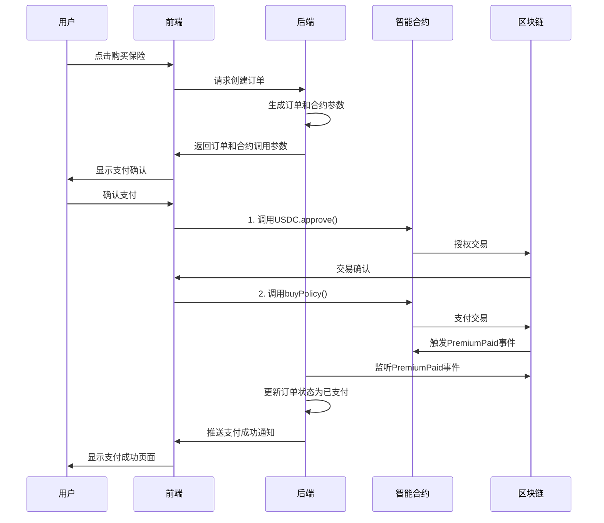

# LiqPass 智能合约与前后端交互分析报告

## 概述

本报告基于智能合约文件 `/Users/zhaomosheng/Desktop/LiqPass-clean/辅助知识页面/智能合约/支付⌚️.md` 中的 CheckoutUSDC 合约实现，详细分析前端和后端需要进行的代码改动，以实现与智能合约的完整交互。

## 智能合约核心信息

### 合约地址配置
- **USDC 合约地址**: `0x833589fCD6eDb6E08f4c7C32D4f71b54bdA02913` (Base 主网)
- **TREASURY 地址**: `0xaa1f4df6fc3ad033cc71d561689189d11ab54f4b` (保费收款地址)
- **CheckoutUSDC 合约**: 需要部署后获取地址

### 核心功能
- `buyPolicy(bytes32 orderId, uint256 amount, bytes32 quoteHash)` - 购买保险
- `PremiumPaid` 事件 - 支付成功事件
- 支持暂停/恢复功能
- 重入攻击防护

## 前端代码改动需求

### 1. Payment.tsx 组件改动

**文件位置**: `/Users/zhaomosheng/Desktop/LiqPass-clean/us-frontend/src/pages/Payment.tsx`

#### 需要添加的导入
```typescript
import { ethers } from 'ethers';
import CheckoutUSDC_ABI from '../abis/CheckoutUSDC.json';
import USDC_ABI from '../abis/USDC.json';
```

#### 需要修改的常量配置
```typescript
// 在文件顶部添加合约地址配置
const CHECKOUT_USDC_ADDRESS = '0x...'; // 部署后的合约地址
const USDC_ADDRESS = '0x833589fCD6eDb6E08f4c7C32D4f71b54bdA02913';
const TREASURY_ADDRESS = '0xaa1f4df6fc3ad033cc71d561689189d11ab54f4b';
```

#### 需要重写的 handlePayment 函数
**当前代码 (第120-141行)**:
```typescript
const handlePayment = async () => {
  if (!address) {
    push({ title: t.walletRequired, type: 'error' });
    return;
  }

  if (!onBase) {
    push({ title: '请切换到Base网络', type: 'error' });
    return;
  }

  setIsProcessing(true);
  
  // 模拟支付处理
  setTimeout(() => {
    setIsProcessing(false);
    // ... 模拟逻辑
  }, 2000);
};
```

**需要修改为**:
```typescript
const handlePayment = async () => {
  if (!address) {
    push({ title: t.walletRequired, type: 'error' });
    return;
  }

  if (!onBase) {
    push({ title: '请切换到Base网络', type: 'error' });
    return;
  }

  setIsProcessing(true);
  
  try {
    const provider = new ethers.BrowserProvider(window.ethereum);
    const signer = await provider.getSigner();
    
    // 1. 先授权USDC给CheckoutUSDC合约
    const usdcContract = new ethers.Contract(USDC_ADDRESS, USDC_ABI, signer);
    const amount = paymentData.kind === 'quote' 
      ? ethers.parseUnits(quoteData.feeUSDC.toString(), 6)
      : ethers.parseUnits(linkData.amount.toString(), 6);
    
    const approveTx = await usdcContract.approve(CHECKOUT_USDC_ADDRESS, amount);
    await approveTx.wait();
    
    // 2. 调用buyPolicy函数
    const checkoutContract = new ethers.Contract(CHECKOUT_USDC_ADDRESS, CheckoutUSDC_ABI, signer);
    
    // 生成orderId (使用keccak256(UUID))
    const orderId = ethers.keccak256(ethers.toUtf8Bytes(generateOrderUUID()));
    
    // 生成quoteHash (报价快照哈希)
    const quoteHash = ethers.keccak256(ethers.toUtf8Bytes(JSON.stringify(quoteData || linkData)));
    
    const buyPolicyTx = await checkoutContract.buyPolicy(orderId, amount, quoteHash);
    const receipt = await buyPolicyTx.wait();
    
    // 3. 监听PremiumPaid事件
    const premiumPaidEvent = receipt.logs.find(log => 
      log.topics[0] === ethers.id('PremiumPaid(bytes32,address,uint256,bytes32)')
    );
    
    if (premiumPaidEvent) {
      push({ title: '支付成功', type: 'success' });
      navigate('/success');
    }
    
  } catch (error) {
    console.error('支付失败:', error);
    push({ title: '支付失败，请重试', type: 'error' });
  } finally {
    setIsProcessing(false);
  }
};
```

#### 需要添加的工具函数
```typescript
// 生成订单UUID
const generateOrderUUID = () => {
  return 'xxxxxxxx-xxxx-4xxx-yxxx-xxxxxxxxxxxx'.replace(/[xy]/g, function(c) {
    const r = Math.random() * 16 | 0;
    const v = c == 'x' ? r : (r & 0x3 | 0x8);
    return v.toString(16);
  });
};
```

### 2. WalletContext.tsx 适配

**文件位置**: `/Users/zhaomosheng/Desktop/LiqPass-clean/us-frontend/src/contexts/WalletContext.tsx`

#### 需要添加的Base网络配置验证
**当前代码已支持Base网络切换，但需要确保**:
- Base主网配置正确: `BASE_MAINNET` 常量
- 网络切换后自动刷新合约连接

## 后端代码改动需求

### 1. orders.ts 路由改动

**文件位置**: `/Users/zhaomosheng/Desktop/LiqPass-clean/us-backend/src/routes/orders.ts`

#### 需要添加的事件监听服务
```typescript
// 在文件顶部添加事件监听相关导入
import { ethers } from 'ethers';
import CheckoutUSDC_ABI from './abis/CheckoutUSDC.json';

// 添加事件监听服务
class EventListenerService {
  private provider: ethers.JsonRpcProvider;
  private checkoutContract: ethers.Contract;
  
  constructor(rpcUrl: string, contractAddress: string) {
    this.provider = new ethers.JsonRpcProvider(rpcUrl);
    this.checkoutContract = new ethers.Contract(contractAddress, CheckoutUSDC_ABI, this.provider);
    this.setupEventListeners();
  }
  
  private setupEventListeners() {
    // 监听PremiumPaid事件
    this.checkoutContract.on('PremiumPaid', async (orderId, buyer, amount, quoteHash, event) => {
      try {
        // 更新订单状态为已支付
        await this.updateOrderStatus(orderId, 'paid');
        console.log(`订单 ${orderId} 支付成功`);
      } catch (error) {
        console.error('处理支付事件失败:', error);
      }
    });
  }
  
  private async updateOrderStatus(orderId: string, status: string) {
    // 调用orderService更新订单状态
    // 需要与现有订单服务集成
  }
}
```

#### 需要修改的订单创建逻辑
**当前创建订单接口 (第70-110行)**:
```typescript
router.post('/orders', orderAuth, (req, res) => {
  const parsed = createSchema.safeParse(req.body);
  // ... 现有逻辑
});
```

**需要增强为**:
```typescript
router.post('/orders', orderAuth, async (req, res) => {
  const parsed = createSchema.safeParse(req.body);
  if (!parsed.success) {
    return res.status(400).json({
      ok: false,
      error: 'INVALID_REQUEST',
      issues: parsed.error.issues
    });
  }

  try {
    const { order, created } = orderService.createOrder(parsed.data);
    const payment = orderService.getPaymentConfig();
    
    // 生成智能合约需要的参数
    const orderId = ethers.keccak256(ethers.toUtf8Bytes(order.id));
    const amount = ethers.parseUnits(order.premiumUSDC.toString(), 6);
    const quoteHash = ethers.keccak256(ethers.toUtf8Bytes(JSON.stringify({
      skuId: order.skuId,
      principal: parsed.data.principal,
      leverage: parsed.data.leverage,
      // ... 其他报价参数
    })));
    
    // 返回智能合约调用参数
    return res.status(created ? 201 : 200).json({
      ok: true,
      order: {
        // ... 现有订单信息
      },
      contractCall: {
        orderId: orderId,
        amount: amount.toString(),
        quoteHash: quoteHash,
        checkoutAddress: CHECKOUT_USDC_ADDRESS,
        usdcAddress: USDC_ADDRESS
      }
    });
  } catch (error) {
    // ... 错误处理
  }
});
```

### 2. 需要新增的服务文件

#### 创建智能合约交互服务
**文件位置**: `/Users/zhaomosheng/Desktop/LiqPass-clean/us-backend/src/services/contractService.ts`

```typescript
import { ethers } from 'ethers';

export class ContractService {
  private provider: ethers.JsonRpcProvider;
  private wallet: ethers.Wallet;
  
  constructor(rpcUrl: string, privateKey: string) {
    this.provider = new ethers.JsonRpcProvider(rpcUrl);
    this.wallet = new ethers.Wallet(privateKey, this.provider);
  }
  
  // 验证支付状态
  async verifyPayment(orderId: string, expectedAmount: bigint): Promise<boolean> {
    // 查询链上交易记录验证支付
    // 实现逻辑...
  }
  
  // 获取合约状态
  async getContractStatus(): Promise<any> {
    // 检查合约是否暂停等状态
    // 实现逻辑...
  }
}
```

## 交互流程详解

### 1. 保险购买完整流程



### 2. 关键交互点

1. **前端与合约交互**: 
   - USDC授权调用
   - buyPolicy函数调用
   - 交易状态监听

2. **后端与合约交互**:
   - PremiumPaid事件监听
   - 订单状态同步
   - 支付验证

3. **数据一致性保证**:
   - 订单ID在前后端和合约中保持一致
   - 支付金额精确到6位小数
   - 事件驱动的状态同步

## 技术实现要点

### 安全考虑
1. **重入攻击防护**: 合约已使用ReentrancyGuard
2. **权限控制**: 合约使用Ownable模式
3. **输入验证**: 前后端都需要严格的参数验证
4. **事件驱动**: 后端只信任链上事件

### 性能优化
1. **事件监听**: 使用WebSocket连接提高监听效率
2. **批量处理**: 对事件进行批量处理减少数据库压力
3. **缓存机制**: 缓存合约状态减少链上查询

### 错误处理
1. **交易失败**: 提供清晰的错误提示
2. **网络异常**: 实现重试机制
3. **状态同步**: 处理事件丢失的补偿机制

## 部署和配置

### 环境变量配置
```bash
# 前端配置
VITE_CHECKOUT_USDC_ADDRESS=0x...
VITE_USDC_ADDRESS=0x833589fCD6eDb6E08f4c7C32D4f71b54bdA02913
VITE_BASE_RPC_URL=https://mainnet.base.org

# 后端配置
CHECKOUT_USDC_ADDRESS=0x...
USDC_ADDRESS=0x833589fCD6eDb6E08f4c7C32D4f71b54bdA02913
BASE_RPC_URL=https://mainnet.base.org
CONTRACT_WALLET_PRIVATE_KEY=your_private_key
```

### ABI文件准备
需要准备以下ABI文件：
- `CheckoutUSDC.json` - CheckoutUSDC合约ABI
- `USDC.json` - USDC代币合约ABI

## 测试计划

### 单元测试
1. 前端合约调用测试
2. 后端事件监听测试
3. 订单状态同步测试

### 集成测试
1. 完整支付流程测试
2. 网络切换测试
3. 异常情况处理测试

### 生产环境测试
1. 主网合约部署验证
2. 真实交易测试
3. 性能压力测试

## 总结

本报告详细分析了智能合约与前后端的交互需求，明确了需要改动的具体代码位置和实现方式。通过系统化的改造，可以实现安全、高效的链上保险购买流程，确保数据一致性和用户体验。

**关键改动点**:
- 前端Payment.tsx的支付逻辑重写
- 后端orders.ts的事件监听集成
- 新增合约交互服务
- 完善的安全和错误处理机制

所有改动都需要在测试环境中充分验证后再部署到生产环境。